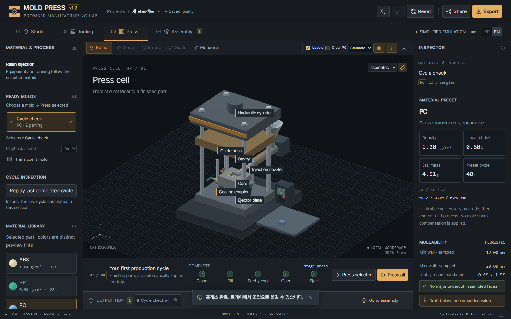

# Molds, materials, and the Mold Press model

English · [한국어](MOLDING.ko.md) · [Back to README](../README.md)

## What is a mold?

A mold is a reusable tool whose surfaces give a material its shape. Injection molds are commonly made from steel or aluminum. In injection molding, material enters an enclosed cavity and solidifies before removal. The mold defines the part; the molding machine holds the mold closed and supplies the material and motion needed for the cycle. Mold Press combines both in one visual workspace.

The term covers more than plastic injection tooling. Compression molds shape a charge under pressure, while die-casting dies receive molten metal. In Korean, *금형* also includes metal tools used for operations such as sheet-metal stamping and forging. These processes use different equipment and material behavior; they are not interchangeable injection processes.

For thermoplastic injection molding, the basic sequence is to plasticize pellets, close and clamp the mold, inject the melt, apply holding pressure, cool, then open and eject the part. Holding pressure helps compensate for contraction while material can still enter the cavity. The machine's heated barrel and screw prepare the melt; the mold's cooling system removes heat. See the [Protolabs injection molding guide](https://www.protolabs.com/resources/guides-and-trend-reports/injection-molding-guide-process-design-tips-materials/).

## What is inside an injection mold?

| Element | Function in real tooling |
| --- | --- |
| Cavity and core | Complementary forming surfaces. For a cup, the cavity commonly forms the outside and the core forms the inside. |
| Parting surface | The interface where mold halves meet and separate; its trace can leave a parting line on the product. |
| Sprue, runner, and gate | Passages that deliver melt to the part. The gate is the entrance to the part cavity; feed-system designs vary. |
| Guide pins and bushes | Align the mold halves during closing. |
| Ejector system | Pushes the cooled part away from the retaining mold half. Pins need suitable contact positions and support. |
| Side actions, slides, or lifters | Release features that cannot clear the main opening direction. |
| Cooling channels | Circulate coolant through the tool to control temperature. |
| Vents | Let displaced air and gases escape during filling. |

A common horizontal machine has a stationary cavity side and a moving core/ejector side, with the part intended to remain on the ejector side when the mold opens. This is a common arrangement rather than a rule for every tool. Core/cavity placement and draft affect release, as explained in [Protolabs' core and cavity guide](https://www.protolabs.com/en-gb/resources/design-tips/choosing-core-and-cavity-placement-for-moulded-parts/).

A straight-pull, two-plate mold opens along one principal direction. An undercut traps a feature against that motion and may require a different part design or additional tooling movement. A hollow object is therefore not automatically moldable just because its negative shape can be subtracted from a block. See [side-action design](https://www.protolabs.com/resources/design-tips/using-side-actions-in-molding-design/).

## Which materials are injection molded?

Thermoplastics are the main plastic family represented here. They soften with heat and solidify on cooling. Resin grade, additives, moisture, wall thickness, and process conditions affect the result; a polymer name alone is not a complete material specification.

| Material | Typical uses and considerations | Built into this app |
| --- | --- | --- |
| ABS | Housings and general-purpose rigid parts; useful impact resistance and surface finish. | Yes |
| PP, polypropylene | Containers, lids, and living hinges; light and chemically resistant, with shrinkage to consider. | Yes |
| PC, polycarbonate | Transparent covers and impact-resistant housings; drying and chemical compatibility matter. | Yes |
| PA, nylon | Gears, clips, and mechanical parts; moisture changes dimensions and properties. PA6 and PA66 are distinct families. | Generic Nylon preset |
| PE, polyethylene | Bottles, containers, and flexible components; behavior differs between grades such as HDPE and LDPE. | No |
| PS, polystyrene | Packaging and disposable rigid parts; unmodified grades can be brittle. | No |
| POM, acetal | Gears and sliding components where friction and dimensional behavior matter. | No |
| PBT | Electrical connectors and engineering housings; reinforced grades are common. | No |

These are examples, not an exhaustive ranking. The [Protolabs thermoplastic selection guide](https://www.protolabs.com/resources/guides-and-trend-reports/thermoplastic-material-selection-for-injection-molding/) compares material families; its [process guide](https://www.protolabs.com/resources/guides-and-trend-reports/injection-molding-guide-process-design-tips-materials/) also distinguishes commodity and engineering thermoplastics.

**CF Nylon** in the app means carbon-fiber-filled nylon. Injection-moldable compounds contain fibers dispersed in a polymer, rather than a woven carbon sheet. Fiber content, base resin, and fiber orientation can change stiffness and shrinkage. The app's rough, short-fiber appearance is illustrative and does not model those properties. [RTP's structural compounds overview](https://www.rtpcompany.com/products/structural/) describes reinforced compounds for injection molding.

The two metal presets represent separate process ideas:

- **Zinc** selects a casting sequence. Actual zinc die casting uses specified alloys, including Zamak and ZA families; this preset does not identify a production alloy. [Xometry's die-casting FAQ](https://community.xometry.com/kb/articles/760-die-casting-frequently-asked-questions) lists common zinc and aluminum casting alloys.
- **Aluminum 6061** selects a conceptual compression/forging sequence. 6061 is a heat-treatable alloy used in products such as extrusions; it is not a thermoplastic. Common aluminum die-casting alloy lists instead include grades such as A380 and ADC12. The app's 6061 choice should therefore be read as a forming illustration, not a validated die-casting recipe. See [Hydro's 6061 alloy description](https://www.hydro.com/us/global/aluminum/products/extruded-profiles/alloys-for-aluminum-extrusions/6061-alloy/) and the casting FAQ above.

## What kind of mold does the app create?

The current implementation resembles a simplified two-plate mold with one flat parting plane. Each source body gets its own tool; generating all molds does not design a balanced multi-cavity production mold.

1. The app calculates the part's bounding box in world coordinates and adds 12 mm of stock on every side.
2. A plane perpendicular to X, Y, or Z divides that stock into two rectangular blocks. You choose the opening axis and plane position.
3. The part's triangle mesh is subtracted from each block with Boolean geometry operations. The resulting records are named **cavity** and **core**.
4. Generic pins, a gate and runner, cooling paths, guides, bushes, and an ejector plate are added. Simplified side-core blocks can be included by configuration or an undercut heuristic.

The names describe the two generated halves. The app does not automatically design a suitable core insert, shutoff surface, slide mechanism, or mold base for every feature. Its vertical press presentation moves the upper mold half while the lower half remains in place; this visual arrangement should not be confused with every real machine's fixed/moving-side convention.

*An app visualization of simplified components, not a drawing of a production tool.*

Gate, runner, and cooling records are visible solid shapes used to illustrate paths. They are not all machined passageways subtracted from the steel. Hollow bushes and moving ejector parts add visual detail, but there is no complete set of fitted bores, tolerances, fasteners, sealing features, and support plates. The four default ejector pins use generic locations rather than contact points selected from a release-force analysis. Vents are not generated.

Section caps, transparency, and opening gaps help inspect this geometry. Section caps affect the display only. They do not cut or repair the stored mesh. Implementation details are in [mold generation](../js/tooling/molds.js) and [process geometry](../js/press/processes.js).

## Where does the simulation differ from production?

| Topic | Mold Press behavior | What a production design needs |
| --- | --- | --- |
| Parting and release | One axis-aligned plane, generic side cores, sampled draft and undercut checks. | Feature-specific release paths, shutoffs, insert design, and complete interference checks. |
| Filling | Reveals a clipped part mesh in discrete steps, with visual fallbacks. | Melt-flow behavior including viscosity, pressure, temperature, air traps, weld lines, and incomplete filling. |
| Cooling | A timed stage and visual changes. | Heat-transfer calculations or measurements and a cooling design suited to the part and tool. |
| Shrinkage | One preset factor uniformly scales the completed part about its bounding-box center. | Grade- and process-specific shrinkage, including directional effects, and compensated cavity dimensions. |
| Compression | An illustrative charge and changing geometry. | Material flow, deformation, temperature, and force calculations for the actual forming process. |
| Machine and components | Animated plates, pins, nozzles, hoses, and process-specific equipment. | Machine selection, clamping force, injection capacity, structural sizing, clearances, and coordinated mechanisms. |
| Surface appearance | Procedural grain, brushed metal, and optional clear PC. | Specified tooling finishes and measured surface or optical properties. |
| Output | Project data and tessellated part/assembly exports. | Manufacturing drawings, tolerances, suitable tooling CAD, and an independently prepared machining plan. |

In particular, the cavity is generated from the source part without production shrink compensation. The app later scales the finished part down, so its size change should not be interpreted as the size of a real part made in a compensated tool. Material density, shrinkage, draft, and cycle entries are fixed presets rather than a verified resin or alloy database. Their values are defined in the [material catalog](../js/materials/catalog.js).

Wall, draft, and undercut indicators use sampled geometry and ray tests. They can miss local features and do not prove manufacturability. Auto-selecting an axis chooses among heuristic scores, rather than solving the tool design. The [analysis code](../js/geometry/analysis.js) defines these approximations.

## A useful way to explore

Start with a simple solid, then inspect its mold in Tooling using a section and an opening gap. Move the parting plane to see how the two negative shapes change. Add a recess or overhang and consider which direction each surface must move to release.

Compare a plastic preset, Zinc, and Aluminum 6061 in Press. Pause or step through the cycle to distinguish the illustrated injection, casting, and compression sequences. Use these views to discuss geometry and process order; choosing a real material and designing a real mold requires its grade data and an engineering assessment of the actual part and process.
