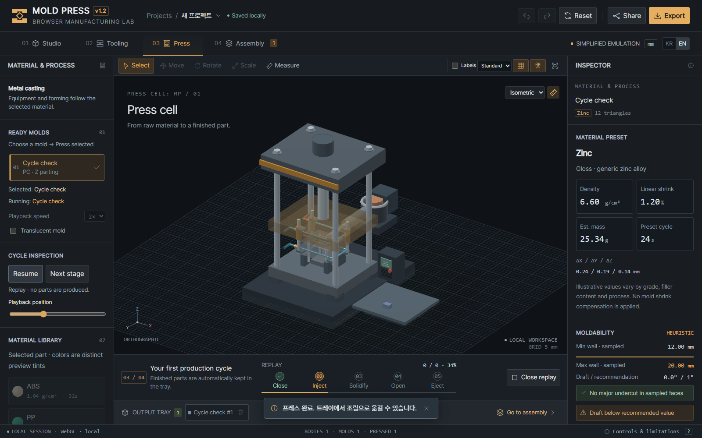
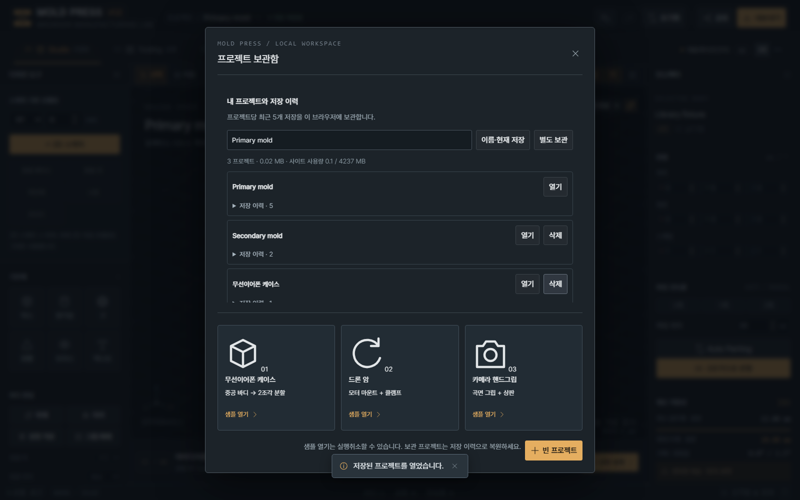

# Verification / 검증 결과

Release **1.2.0** · 2026-09-12

All reports below passed against the same complete runtime fingerprint. The eight implemented improvements and their usage are described in [IMPROVEMENTS.md](IMPROVEMENTS.md).

## Runtime / 실행 구조

- `index.html`: 7,233 bytes.
- 94 external JavaScript files and 15 CSS files.
- Ordered classic scripts preserve direct HTML opening; HTTP(S) enables geometry workers.
- Project schema and the existing localStorage key remain version 1.

Complete runtime SHA-256: `b67f2546fa06fe073fd0e0ff985fbb8f5b6945943389ea01b3b520e7d2e3b16f`

The fingerprint includes HTML and every runtime JS/CSS path and byte, including worker dependencies. 체크섬은 HTML·JS·CSS와 워커 의존성의 경로 및 내용을 모두 포함합니다.

## Checks / 검사

| Suite | Checks | Result |
| --- | ---: | --- |
| JavaScript syntax and asset references | 94 | PASS |
| Sections, rendering, processes, playback, components and worker behavior | 117 | PASS |
| Real-origin project library, history, recovery and storage failures | 12 | PASS |
| Pre-refactor geometry, sketch and mate signatures | 14 | PASS |
| Press, reset, assembly and six KR/EN layouts | 11 | PASS |
| Asynchronous storage race guards | 6 | PASS |
| Ready-mold selection edges | 3 | PASS |
| Built HTTP subdirectory assets, editing and worker execution | 2 | PASS |
| Real-origin workflow and downloads / local WebGL | 7 | PASS |
| Real-origin workflow and downloads / Canvas | 7 | PASS |
| Real-origin workflow and downloads / Three.js r152 | 7 | PASS |

Formatting and asset-reference checks passed. Kernel signatures remain identical to the pre-refactor baseline. The enhancement checks verify capped volumes, all parting axes, equipment selection, real production cycles, replay without duplicate parts, ejector clearance, connected nozzles, worker cancellation and idle overlay behavior. Library checks use real IndexedDB and localStorage in an isolated HTTP origin, including reload, quota failures, invalid revisions and reset recovery.

추가 기능 117개, 실제 브라우저 저장소 검사 12개가 통과했습니다. 저장 이력은 실제 IndexedDB로 검사했고, 초기화 경합 검사는 별도의 명시적 Storage 테스트 대역으로 검증했습니다. 모든 검사는 격리된 브라우저에서 실행하며 사용자의 실제 작업 저장소를 변경하지 않습니다.

## Environment and scope / 환경과 범위

Windows 11, Python 3.14, Node.js 25.9, Playwright 1.58.0 and headless Chromium with software WebGL. Local WebGL, Canvas and the pinned Three.js 0.152.2 renderer each completed the release workflow. The earlier material-specific work also exercised WebGL 1 and high-quality transmission; its scope is recorded in IMPROVEMENTS.md. These results do not certify physical GPU variants, other browser engines or manufacturing accuracy.

Direct-file geometry jobs retain a local fallback that can block during an individual computation. HTTP(S) workers provide responsive heavy operations. Browser site-data deletion removes project archives; JSON is the portable backup. The original user-provided documentation images remain unchanged.

## Visual review / 화면 확인






## Reproduce / 재현

```bash
python -m pip install -r tests/requirements.txt
python -m playwright install chromium
python tests/run_all.py --three
npm ci
npm run format:check
python package.py
```

Packaging requires current passing reports, writes app/source ZIPs under `dist/`, includes the MIT license and embeds the reports under `verification/`. GitHub CI repeats the offline checks on push. The configured Pages site publishes the `main` branch root automatically; the manual deployment workflow remains optional for Actions-based Pages installations.
