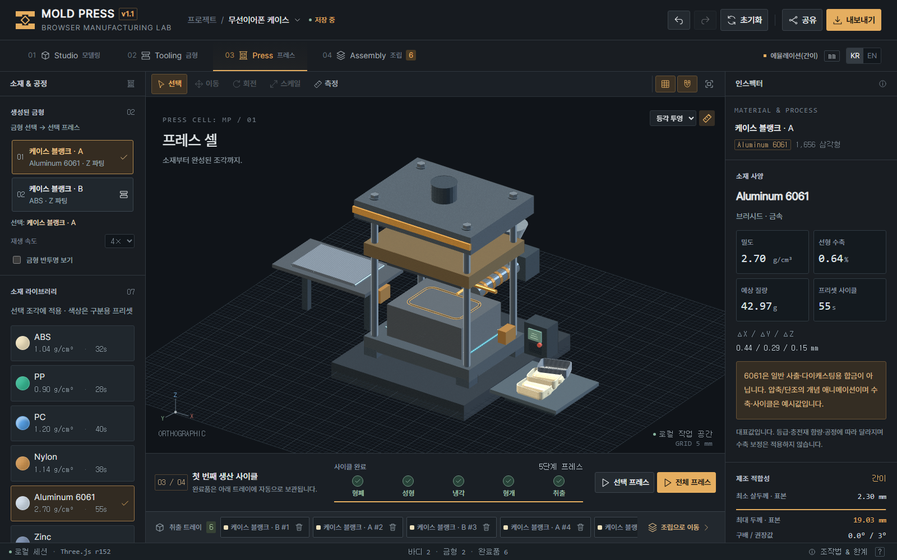
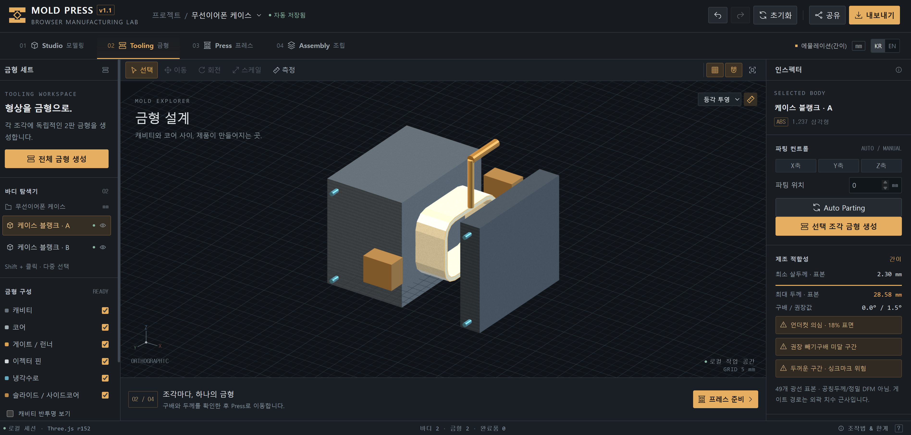
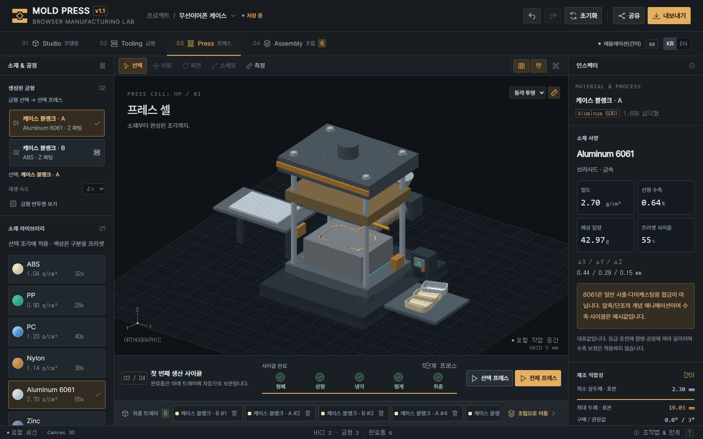

# Verification / 검증 결과

Baseline version **1.1.1** · 2026-09-08

This record covers the original release. Subsequent feature work and its checks are tracked in [IMPROVEMENTS.md](IMPROVEMENTS.md) and GitHub CI.

## Runtime structure / 실행 구조

- `index.html`: 6,363 bytes (previous single-file HTML: 490,351 bytes).
- 81 JavaScript files, including two preserved vendor files.
- 13 CSS files, preserving original cascade order.
- Source is loaded directly from `js/` and `css/`; no inline application scripts or styles.

Complete runtime SHA-256: `f3ae29d1c917ec25e2d655c6ef3fa7091de173c44563fe223b3d828c07ee388b`

This fingerprint includes the entry HTML and the relative path and contents of every referenced JS/CSS file. It is not an HTML-only checksum.

체크섬은 HTML뿐 아니라 실행에 필요한 모든 JS/CSS의 상대 경로와 내용을 포함합니다.

## Checks / 검사

| Suite | Checks | Result |
| --- | ---: | --- |
| External JS syntax and asset references | 81 | PASS |
| Pre-refactor geometry/sketch/mate signatures | 14 | PASS |
| Built site under an HTTP subdirectory | 2 | PASS |
| Press, reset, assembly and six KR/EN layouts | 11 | PASS |
| Storage-double asynchronous race guards | 6 | PASS |
| Ready-mold selection edges | 3 | PASS |
| Real-origin workflow / local WebGL | 7 | PASS |
| Real-origin workflow / Canvas 3D | 7 | PASS |
| Real-origin workflow / Three.js r152 | 7 | PASS |

Formatting: `npm run format:check` passed. The built `/site/` application fetched every external asset successfully and performed an edit. Kernel signatures compare mesh hashes, dimensions, volume, feature regeneration and mate transforms against the pre-refactor 1.1.0 release.

포매팅 검사, 배포 폴더의 하위 경로 로딩 및 편집 검사가 통과했습니다. 커널 회귀는 분리 전 1.1.0과 메쉬 해시·치수·체적·피처 재생성·Mate 변환을 비교했습니다.

## Environment / 환경

Windows 11, Python 3.14, Node.js 25.9, Playwright 1.58.0, headless Chromium with software WebGL; separate Canvas-only run. Three.js uses the existing optional 0.152.2 CDN dependency. Browser workflows use the actual external-file entrypoint or local HTTP. Only the explicit Storage-double suite assembles an in-memory inline test document to isolate storage races.

The table records local verification. The GitHub CI workflow repeats the offline checks on push; the optional CDN renderer is verified locally. Physical GPU variants and other browser engines remain outside the recorded scope.

## Visual review / 화면







## Reproduce / 재현

```bash
python -m pip install -r tests/requirements.txt
python -m playwright install chromium
python tests/run_all.py --three
npm ci
npm run format:check
python package.py
```

Reports are written to `tests/output/` and copied into release ZIPs under `verification/`. The previous release and its original QA are preserved in `archive/v1.1.0/`.
